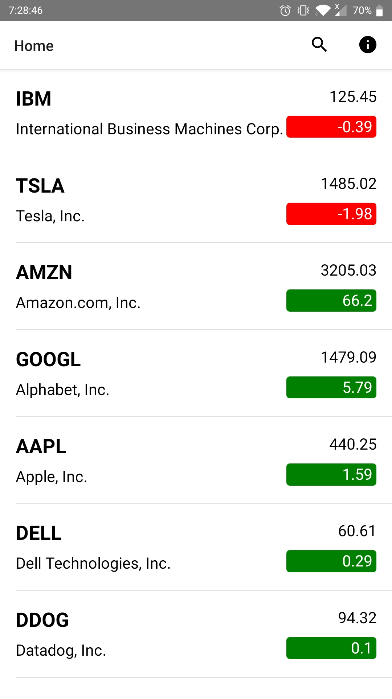
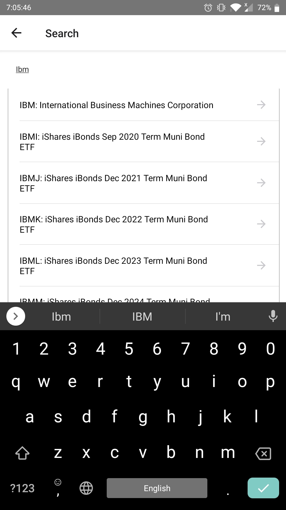
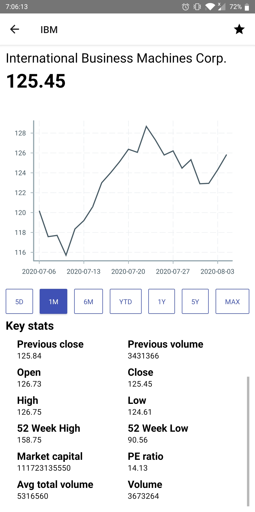
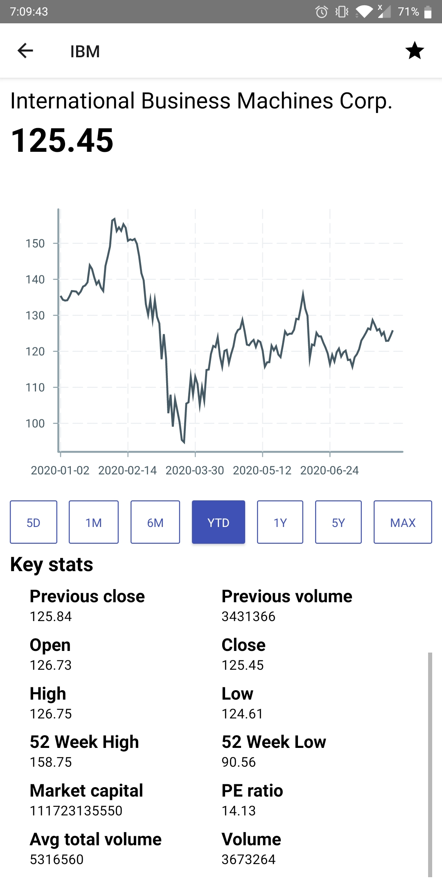

# myStocksRN

Display Stocks using React Native written in Typescript

# Screenshots

<!-- 

 -->

<table>
  <tr>
    <td></td>
    <td></td>
  </tr>
  <tr>
    <td></td>
    <td></td>
  </tr>
</table>

---

<!-- TOC -->

- [myStocksRN](#mystocksrn)
- [Screenshots](#screenshots)
- [npm scripts](#npm-scripts)
  - [common used scripts](#common-used-scripts)

<!-- /TOC -->

# npm scripts

- **start** start react native server
- **test** run tests
- **lint** lint code using typescript and eslint
- **lint:eslint** lint code using eslint
- **lint:tsc** lint code using typescript
- **prettier:write** prettify code that have file extension of .js, .jsx, .ts, .tsx and .json
- **android:clean** clean android builds and caches
- **android:debug** build android debug APK and launch in simulator or tethered android device
- **android:release** build android release APK and launch in simulator or tethered android device
- **build:android:all** build android debug and release APK
- **build:android:debug** build android debug APK
- **build:android:release** build android release APK
- **fastlane:android:all** build android debug and release APK using fastlane
- **fastlane:android:debug** build android debug APK using fastlane
- **fastlane:android:release** build android release APK using fastlane

## common used scripts

- `yarn android:clean && yarn android:debug`
  - clean android caches
  - build android debug APK
  - launch on simulator or tethered android device
- `yarn android:clean && yarn android:release`
  - clean android caches
  - build android release APK
  - launch on simulator or tethered android device
- `yarn android:clean && yarn build:debug`
  - clean android caches
  - build android debug APK
- `yarn android:clean && yarn build:release`
  - clean android caches
  - build android release APK
